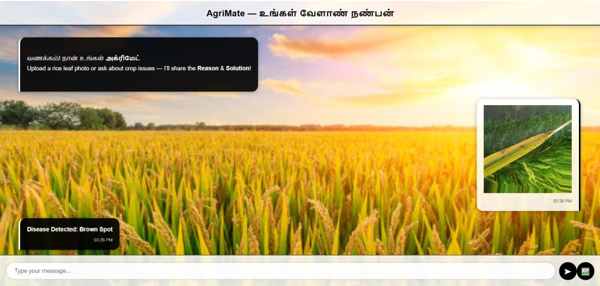
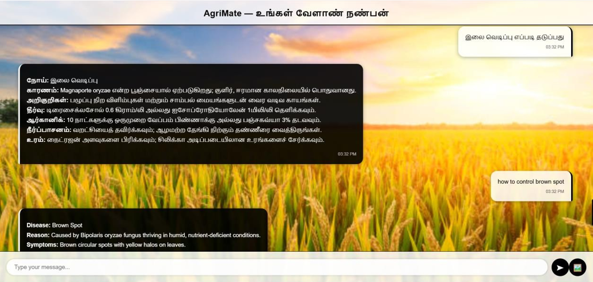
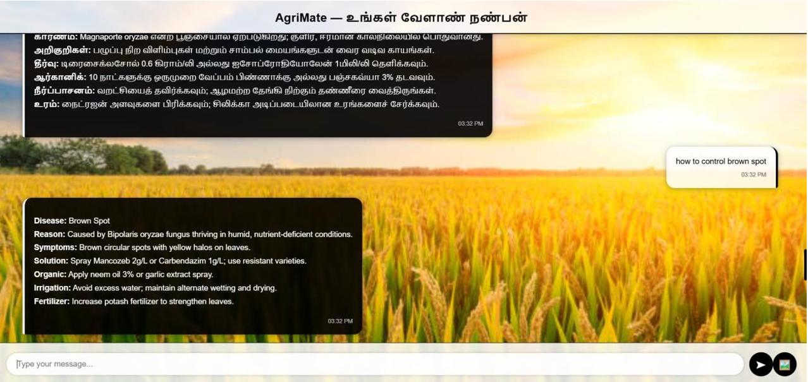
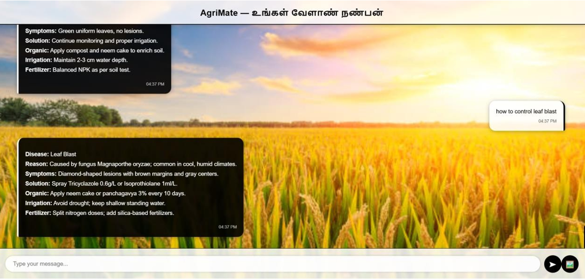

# AgriMate – AI Crop Disease Detection & Advisory System

## Overview

AgriMate is an AI-powered system that detects rice leaf diseases using deep learning and provides multilingual advisory support using NLP and semantic search.

## Features

* Image-based disease detection using CNN (ResNet18)
* NLP-based semantic search using MiniLM embeddings
* Multilingual chatbot (English, Tamil, Tanglish)
* MongoDB vector database integration
* Real-time response using Flask backend

## Tech Stack

* Python
* Flask
* PyTorch
* HuggingFace Transformers
* MongoDB Atlas
* HTML, CSS, JavaScript

## Architecture

User Input → CNN Model → NLP Embedding → Vector Search → Response Generation

## Demo

### Chatbot Interface

### Disease Detection (Image Input)

### Multilingual Support

#### Tamil Response

#### English Response

#### Tanglish Query

### NLP Query

## How to Run

1. Clone repository:
   git clone https://github.com/kanigashree152003/AgriMate---Chatbot.git

2. Go to folder:
   cd AgriMate---Chatbot

3. Install dependencies:
   pip install -r requirements.txt

4. Run app:
   python backend/app.py

5. Open browser:
   http://localhost:5000
   
Note:
This project runs locally. The UI will work only when the Flask server is running.

## Model Details

* CNN: ResNet18
* NLP: all-MiniLM-L6-v2
* Similarity: Cosine similarity

## Dataset

Rice leaf disease dataset (public sources)

(Note: Dataset not included due to size)

## Performance

* Accuracy: ~98%
* Response time: ~2 seconds

## Future Improvements

* Voice-based chatbot
* Multi-crop support
* Cloud deployment

## Author

Kanigashree R
MSc Data Analytics
